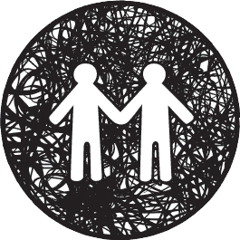
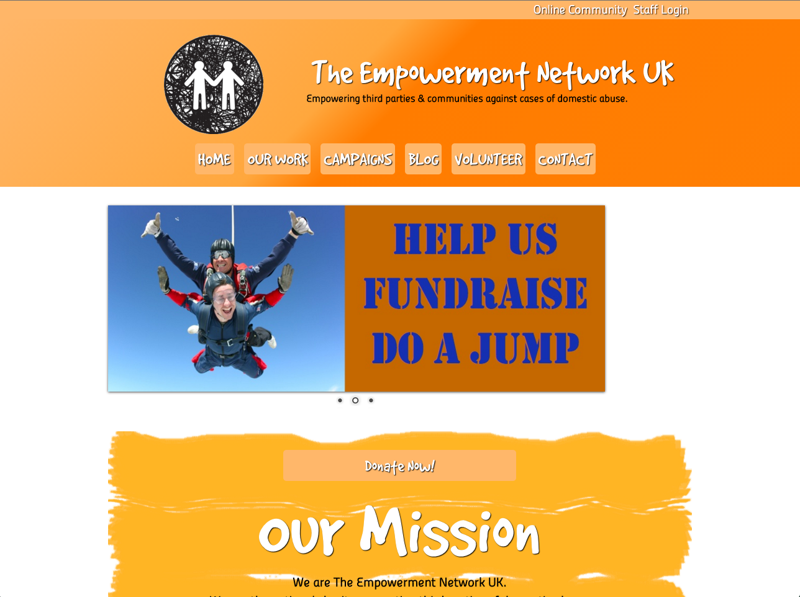

# tenuk-website-production

The Empowerment Network UK - Empowering third parties &amp; communities against cases of domestic abuse.

## Website Link

<a href="http://www.tenuk.org.uk/">The Empowement Network UK</a>


## Project Description

This repository contains the basic HTML template, CSS custom grid and functions.js files used to create the website on behalf of the charity above and it's used both as a backup and to show off my work.



## Technologies used

- HTML5
- pure CSS, no preprocessors supported by Neetrix CMS
- jQuery (already used for Nivo Slider)
- javascript Cookies
- FontAwesome

## Setting Cookies with javascript Cookies

``` javascript
  <script>
    $(function(){
      var cookieVal = Cookies.set("cookieAcceptance");
      if(cookieVal !== "Accepted"){
        // show the button if cookies not accepted
        $('.cookie-acceptance').show();
      }
    });
    function cookiesAccepted(){
      Cookies.set("cookieAcceptance", "Accepted", { expires : 365 });
      $('.cookie-acceptance').slideUp('slow');
    }      
  </script>

```

## Custom CSS simple grid

``` css
      html, body {margin:0;padding:0;}
      .row {clear:both;}
      .row:after {
          content:'';
          display:block;
          clear:both;
      }
      .col, .column {
          min-height:1px;
      	float:left;
      	box-sizing:border-box;
      	list-style:none;
      	margin:0;
      }
      .wrapper{
           width:940px;
          margin:0 auto;
          padding: 20px 20px;
      }
      .wrapper .wrapper {
          padding:0;
          width:auto;
      }
      .wrapper:after {display:block;content:'';clear:both;}
      container:after, .wrapper:after {
      	content:'';
      	display:block;
      	clear:both;
      }

      /* Guttering */
      .guttering-5 {
          margin-left:-2.5px;
          margin-right:-2.5px;
      }
      .guttering-5 .col {
          padding-left:2.5px;
          padding-right:2.5px;
      }
      .guttering-10 {
          margin-left:-5px;
          margin-right:-5px;
      }
      .guttering-10 .col {
          padding-left:5px;
          padding-right:5px;
      }
      .guttering-20 {
          margin-left:-10px;
          margin-right:-10px;
      }
      .guttering-20 .col {
          padding-left:10px;
          padding-right:10px;
      }
      	.column.small {
      		width:202px;
      	}
      	.column.large {
      		width:738px;
      		padding-left:20px;
      	}
      	.basket .column.small {width: 277px;}
      	.basket .column.large {width: 663px;}
      	.col-940-12 {
              width:100%;
              padding:0;
      	}
      	.col-940-11 {
      	    width:91%;
      	}
      	.col-940-10 {
      	    width:83%;
      	}
      	.col-940-9 {
      	    width:75%;
      	}
      	.col-940-8 {
      	    width:66.6%;
      	}
      	.col-940-7 {
      	    width:58.3%;
      	}
      	.col-940-6 {
      	    width:50%;
      	}
      	.col-940-5 {
      	    width:41.6%;
      	}
      	.col-940-4 {
      	    width:33.3%;
      	}
      	.col-940-3 {
      	    width:25%;
      	}
      	.col-940-2 {
      	    width:16.6%;
      	}
      	.col-940-1 {
      	    width:8.3%;
      	}
      	.hidden-940 {
      	    display:none;
      	}

      @media screen and (min-width:768px) and (max-width:979px) {
      	.wrapper {width:728px;}
      	.column.small {
      		width:183px;
      	}
      	.column.large {
      		width:545px;
      		padding-left:20px;
      	}
      	.basket .column.small {width: 100%;}
      	.basket .column.large {width: 100%;padding:0;}
      	.col-768-12 {
              width:100%;
              padding:0;
      	}
      	.col-768-11 {
      	    width:91%;
      	}
      	.col-768-10 {
      	    width:83%;
      	}
      	.col-768-9 {
      	    width:75%;
      	}
      	.col-768-8 {
      	    width:66.6%;
      	}
      	.col-768-7 {
      	    width:58.3%;
      	}
      	.col-768-6 {
      	    width:50%;
      	}
      	.col-768-5 {
      	    width:41.6%;
      	}
      	.col-768-4 {
      	    width:33.3%;
      	}
      	.col-768-3 {
      	    width:25%;
      	}
      	.col-768-2 {
      	    width:16.6%;
      	}
      	.col-768-1 {
      	    width:8.3%;
      	}
      	.hidden-768 {
      	    display:none;
      	}
      }
      @media screen and (max-width:767px) {
      	.wrapper {width:460px;padding:10px 10px;}
      	.column.small {
      		width:100%;
      	}
      	.column.large {
      		width:100%;
      		padding:0;
      	}
      	.basket .column.small {width: 100%;}
      	.basket .column.large {width: 100%;}
      	.col-480-12 {
              width:100%;
              padding:0;
      	}
      	.col-480-11 {
      	    width:91%;
      	}
      	.col-480-10 {
      	    width:83%;
      	}
      	.col-480-9 {
      	    width:75%;
      	}
      	.col-480-8 {
      	    width:66.6%;
      	}
      	.col-480-7 {
      	    width:58.3%;
      	}
      	.col-480-6 {
      	    width:50%;
      	}
      	.col-480-5 {
      	    width:41.6%;
      	}
      	.col-480-4 {
      	    width:33.3%;
      	}
      	.col-480-3 {
      	    width:25%;
      	}
      	.col-480-2 {
      	    width:16.6%;
      	}
      	.col-480-1 {
      	    width:8.3%;
      	}
      	.hidden-480 {
      	    display:none;
      	}
      }
      @media screen and (min-width:0px) and (max-width:479px) {
      	.wrapper {width:300px;padding:10px 10px;}
      	.col-320-12 {
              width:100%;
              padding:0;
      	}
      	.col-320-11 {
      	    width:91%;
      	}
      	.col-320-10 {
      	    width:83%;
      	}
      	.col-320-9 {
      	    width:75%;
      	}
      	.col-320-8 {
      	    width:66.6%;
      	}
      	.col-320-7 {
      	    width:58.3%;
      	}
      	.col-320-6 {
      	    width:50%;
      	}
      	.col-320-5 {
      	    width:41.6%;
      	}
      	.col-320-4 {
      	    width:33.3%;
      	}
      	.col-320-3 {
      	    width:25%;
      	}
      	.col-320-2 {
      	    width:16.6%;
      	}
      	.col-320-1 {
      	    width:8.3%;
      	}
      	.hidden-320 {
      	    display:none;
      	}
      }

```

## Note: The Website is self managed.

## License

[](http://creativecommons.org/publicdomain/zero/1.0/)
